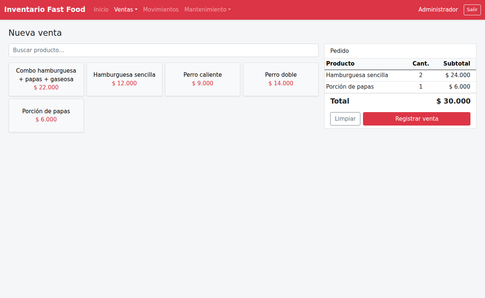

# SISTEMA_INVENTARIO

Sistema de Inventario para un Local de Comidas Rápidas

ASP.NET Core MVC (.NET 10) · C# · JavaScript · SQL Server (ADO.NET + procedimientos almacenados)

## Estructura (N-capas)

| Proyecto | Contenido |
|---|---|
| `BaseDatos/01_BaseDatos.sql` | Base de datos, tablas y procedimientos almacenados (borra y crea la base) |
| `BaseDatos/02_DatosIniciales.sql` | Menú, insumos, recetas y adiciones de John Wick (tomados del Excel de costos) |
| `BaseDatos/03_Actualizacion_v3.sql` | Versión 3: cocina, edición y anulación de pedidos, salsas, domicilios y cierre de caja. No borra datos |
| `CapaEntidad` | Clases: Usuario, Categoria, Proveedor, Insumo, Movimiento, ProductoMenu, Venta... |
| `CapaDatos` | `Conexion.cs` (ADO.NET) y repositorios `CD_*` que llaman a los SP |
| `CapaNegocio` | Validaciones `CN_*` y `Seguridad.cs` (contraseñas con PBKDF2) |
| `CapaPresentacion` | ASP.NET Core MVC: controladores, vistas Razor y JS (`wwwroot/js`) con `fetch` |

## Módulos

- **Inicio**: ventas y pedidos del día, domicilios pendientes, estado de la caja, insumos por pedir y lotes por vencer.
- **Vender**: tarjetas de productos con foto; los **más vendidos** (últimos 30 días) salen primero con su puesto (Top 1 a 5) y cada tarjeta avisa cuántas unidades alcanzan con el inventario ("Quedan 3", "Agotado"). Al tocar un producto se eligen **salsas**, adiciones y preferencias, y notas para cocina; el botón **+** agrega sin opciones. Pedido en mesa, para llevar o a domicilio, pago en efectivo (con cambio), tarjeta o transferencia, ticket de 80 mm y **comanda de cocina**. Pedidos **en espera** (guardar sin cobrar y retomar) y atajos de teclado (F2 buscar, Enter agregar, F9 cobrar).
- **Editar o anular un pedido**: solo durante los minutos configurados (5 por defecto) y mientras cocina no lo haya empezado. Al editar o anular, los insumos vuelven al inventario (movimiento DEVOLUCION en el kardex). El administrador puede anular después, mientras la caja siga abierta.
- **Cocina**: tablero de comandas En cola → Preparando → Listo → Entregado, con reloj por pedido que cambia a amarillo y rojo según el tiempo, aviso sonoro de pedidos nuevos y pantalla completa. Desde Vender, el botón **Comandas** muestra los pedidos en proceso.
- **Domicilios**: tablero Por despachar / En camino / Entregados, con el estado en cocina, el domiciliario que lo lleva, hora de salida y entrega, tiempo total, alerta de demora, cuánto cobrar y cuánto cambio llevar, efectivo por recoger, WhatsApp al cliente, llamada y mapa. Al escribir el teléfono en Vender se reconoce al **cliente frecuente** y se llenan su nombre y dirección.
- **Caja**: apertura con base, totales por forma de pago, conteo por billetes y monedas, aviso de efectivo de domicilios aún en la calle, cierre con el efectivo contado y la diferencia, y **reporte de cierre** imprimible (ventas por forma de pago, productos vendidos y anulaciones).
- **Inventario**: stock por sede, entradas con fecha de vencimiento (lotes), salidas, mermas, kardex, conteo físico con ajuste automático y orden de compra sugerida por proveedor.
- **Reportes**: ventas por día, productos más vendidos, formas de pago, costo de insumos, ganancia y mermas, con gráficas.
- **Exportar**: Excel (inventario, kardex, ventas, orden de compra) y PDF desde el botón imprimir.
- **Plantilla de carga de inventario**: en *Inventario > Insumos*, **Plantilla de carga** descarga un Excel con los insumos actuales, listas de categorías y unidades e instrucciones. Se llena el stock real contado y se sube con **Cargar Excel**: crea o actualiza insumos por código, crea categorías nuevas y ajusta el stock como conteo físico. Si alguna fila tiene errores no se guarda nada.
- **Mantenimiento**: productos con foto y receta (costo y margen), adiciones y modificadores, categorías del menú e insumos, proveedores, usuarios, sedes y **Configuración** (nombre del negocio, NIT, logo, colores, moneda y mensaje del ticket). El sistema es una plantilla: cada negocio lo personaliza desde ahí.
- **Varias sedes**: cada usuario pertenece a una sede; el administrador cambia de sede desde la barra superior.
- **Roles**: ADMINISTRADOR (todo) y CAJERO (inicio, ventas, domicilios y caja).

## Cómo ejecutarlo

1. En SQL Server Management Studio ejecute `BaseDatos/01_BaseDatos.sql`, `BaseDatos/02_DatosIniciales.sql` y `BaseDatos/03_Actualizacion_v3.sql` (SQL Server 2017 o superior). Ojo: el primero borra la base si ya existe.
   Si ya tiene la versión 2 funcionando, ejecute solo `03_Actualizacion_v3.sql`: agrega lo nuevo y conserva sus datos.
2. Revise la cadena `CadenaSQL` en `CapaPresentacion/appsettings.json` (por defecto: `Server=localhost`, autenticación de Windows).
3. Abra `InventarioComidas.sln` en Visual Studio 2026 (con la carga de trabajo "ASP.NET y desarrollo web" y el SDK de .NET 10), marque `CapaPresentacion` como proyecto de inicio y presione F5.
   Por consola: `dotnet run --project CapaPresentacion`.
4. Ingrese con **admin / Admin123** y cambie la contraseña.
5. Suba las fotos de los productos en *Mantenimiento > Productos y recetas* y el logo y colores en *Mantenimiento > Configuración*.

## Reglas importantes

- El stock solo cambia por movimientos (entrada, salida, merma) o ventas; todo queda en el kardex.
- Las ventas y salidas validan stock dentro de una transacción; si falta algún insumo, no se registra nada.
- Registros con historial no se eliminan: se desactivan. Las ventas no se borran: se anulan con motivo y quedan en el historial y en el reporte de cierre.
- Los tiempos de edición, las alertas de cocina y domicilios y el valor del domicilio por defecto se cambian en *Mantenimiento > Configuración*.
- Para vender debe haber una caja abierta en la sede.
- Las fotos y el logo se guardan en `CapaPresentacion/wwwroot/uploads` (JPG, PNG, WEBP o GIF de hasta 3 MB).
- Chart.js y Bootstrap Icons vienen incluidos en `wwwroot/lib`, así que no se necesita internet.

